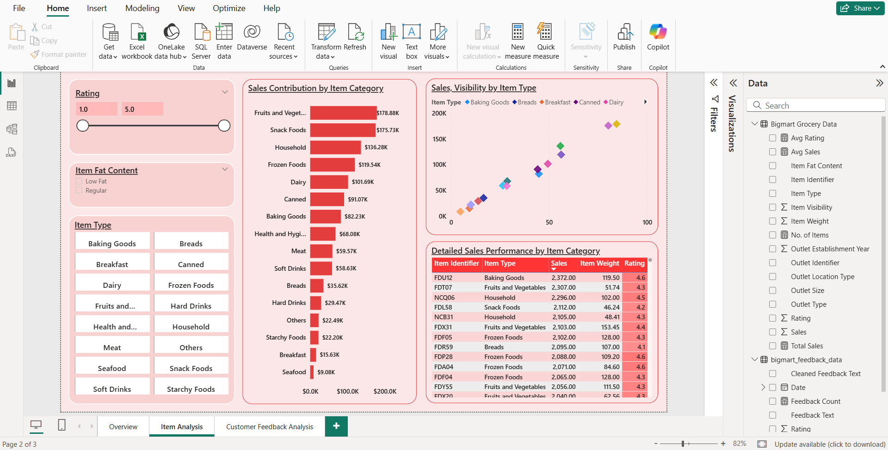
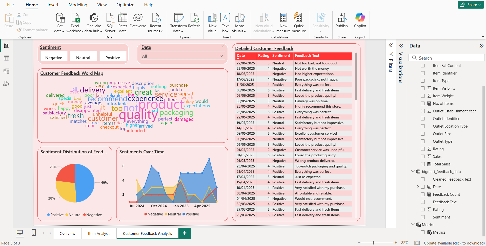

# BigMart Sales and Customer Insights Dashboard 📊

## 1. Overview
Developed an interactive Power BI dashboard to analyze sales performance, product category trends, and customer sentiment for BigMart. Integrated multiple datasets to provide a unified view of total sales, product ratings, and outlet performance.

## 🖼️ Primary Dashboard View

****

## 2. Key Analysis: Inventory & Item Performance

This dashboard page utilizes calculated measures (DAX) to track sales density and profit per item category. The analysis identified the top 5 highest-margin products and exposed categories suffering from high return rates, informing inventory purchasing decisions.

****

## 3. Customer & Segment Insights

We integrated customer survey data to correlate feedback scores with sales performance. The analysis provides key demographic insights and identifies the most valuable customer segments, allowing marketing to optimize spend and target outreach effectively.

****

---

### 🎯 Goal
The objective was to consolidate multi-dimensional Key Performance Indicators (KPIs) into a single, interactive source to improve decision-making speed for strategic planning and sales optimization.

## 2. Tools & Technologies
- **Business Intelligence:** Microsoft Power BI, Data Modeling & Visualization
- **DAX:** Data Analysis Expressions (for custom measures)
- **Data Source:** POS CSV files (50k+ rows, 12 months)
- **ETL:** Power Query for data cleaning and integration

## 3. Key Actions / Process
- **Data Modeling:** Established a robust data model to link sales, product, and customer tables.
- **DAX Measures:** Developed calculated measures for **Avg Sales**, **Avg Rating**, **Total Sales**, and **No. of Items**.
- **Visualization:** Built a highly interactive dashboard with matrix tables to display outlet performance and dynamic filters for granular analysis.
- **Insight Delivery:** Visualized sales trends, product category insights, and customer sentiment, enabling stakeholders to quickly drill down into drivers of performance.

## 4. Key Achievements & Results
- **Strategic Planning:** Enabled stakeholders to **identify top-performing product categories** and **high-revenue outlets** for targeted strategic planning.
- **Actionable Insights:** Provided actionable insights into **customer satisfaction drivers** by linking sales data with sentiment analysis.
- **Efficiency:** Improved decision-making speed by **consolidating multi-dimensional KPIs** into a single interactive dashboard, replacing multiple static reports.

## 5. View Project
- **Live Interactive Dashboard:** [Insert Your NovyPro or Tableau Public Link Here]
- **Source File:** bigmart dashboard.pbix (Available in this repository)
